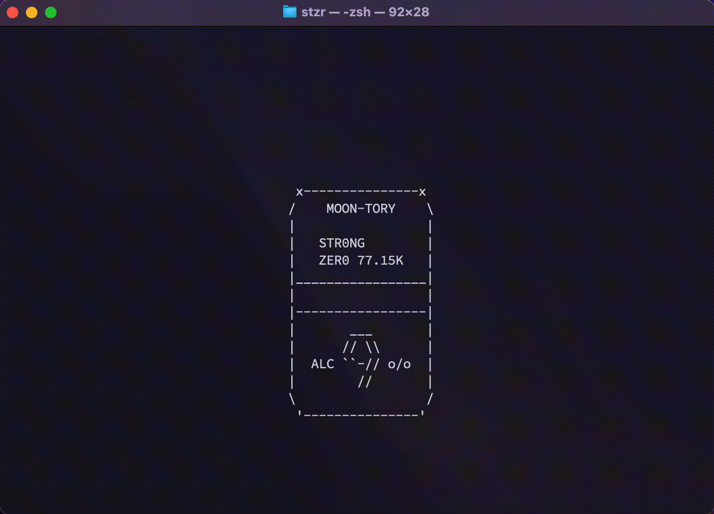

# stzr
## What is this?
ターミナル上に簡素なアニメーションが表示されるコマンド


## Usage
### Prepare
あらかじめ、`gcc`でコンパイルする必要がある。`ncurses`を外部のライブラリとして指定すること(`gcc -o stzr stzr.c -l ncurses`)。

`Makefile`を使うことを用意した。`make`や`make stzr`で使うとよい。

### Run
stzrを開ける(コマンド実行)
```
./stzr
```



### ラベルオプション
| option |      label      |
| ------ | --------------- |
|   -F   |   GRAPEFRUIT    |
|   -L   |      LEMON      |
|   -A   |      APPLE      |
|   -O   |     ORANGE      |
|   -Y   |      YUZU       |
|   -U   |   KANJUKU-UME   |
|   -C   | CITRUS DEPRESSA |
|   -B   |  BITTER  LEMON  |
|   -P   |      PEACH      |
|   -G   |      GRAPE      |
|   -D   |       DRY       |
|   -M   |      MELON      |
|   -R   |     ACEROLA     |
|   -I   |    PINEAPPLE    |
|   -K   |      MIKAN      |


### その他のオプション
#### プルタブを自ら開ける
```
./stzr -p
```
キーボード入力をトリガーに、プルタブが開く

#### ロング缶(500ml)
```
./stzr -l
```

#### スペースシャトル(350ml)
```
./stzr -s
```

#### ロケット(ロング缶)
```
./stzr -r
```


## Requirement
  - gcc
   - Cプログラムをコンパイルするため
   - ライブラリに`ncurses`が必要


## License
これは、[slコマンド](https://github.com/mtoyoda/sl)のオマージュである。一部参考にした要素がある。同コマンドのLICENSEによれば、利用したものを自作であるかのように振る舞わない限り、コピーを含めて、自由に利用を認めるとのこと。stzrコマンドのリポジトリ内で該当するファイルには、規定によりslコマンドのLICENSEを全文表示してある。

stzrコマンドのLicenseは、`MIT License`に準拠する。


## CAUTION
お酒は二十歳になってから(stzrコマンドは年齢問わず、どなたでもご利用いただけます)
